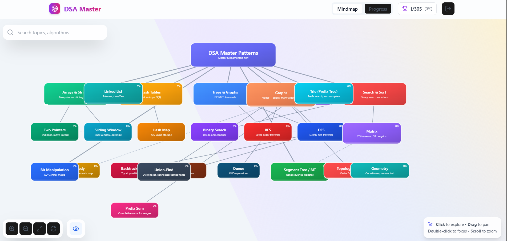
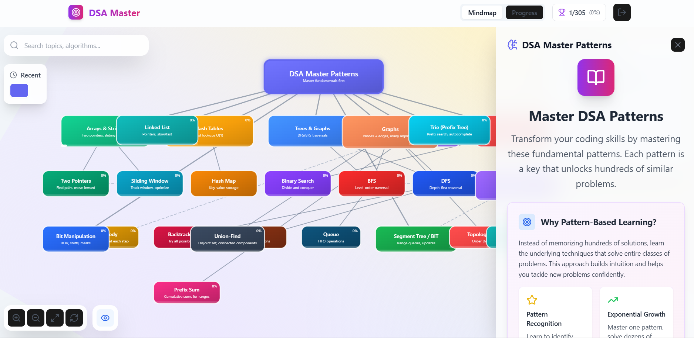
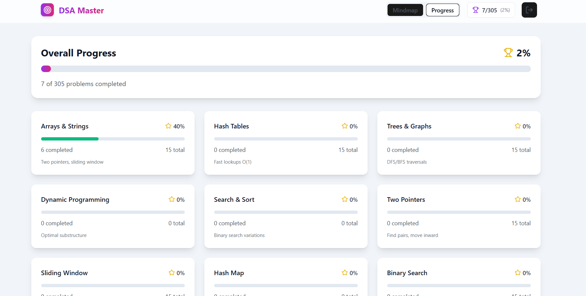

#  DSA Mastery Project   

  
  
  
  

---

## 📖 Overview  

**DSA Mastery Project** is an interactive platform to help learners **master Data Structures & Algorithms (DSA)** through:  

- A **visual mindmap view** (tree-style structure of topics)  
- **Concept notes with time complexities**  
- **15+ curated practice problems per topic** (inspired by Striver’s A2Z sheet)  
- A **progress tracking system** with backend integration  

This project aims to make DSA prep **structured, visual, and trackable**  

---

##  Features  

### 1. Mindmap View   
- Displays **parent-child hierarchy** of concepts.  
- Example: `Arrays → Prefix Sum → Two Pointers → Sliding Window`.  
- Helps learners see **dependencies between concepts**.  

### 2. Problem Sets   
- Each concept has **15+ curated problems**.  
- Inspired by **Striver’s A2Z DSA Sheet**.  
- Problems categorized as:  
  - Easy  
  - Medium   
  - Hard   
- Each problem shows status: *Not Started*, *In Progress*, *Completed*.  

### 3. Progress Tracking   
- Progress saved in **MongoDB via backend APIs**.  
- Dashboard view includes:  
  - % of topics completed  
  - Problems solved count  
  - Weak areas  

### 4. Time Complexity Notes ⏱️  
- Every concept includes **time & space complexity notes**.  
- Example:  
  - Binary Search → O(log n)  
  - Prefix Sum → O(n) preprocessing, O(1) queries  

### 5. Dashboard & Reports 📈  
- Displays solved problems & completed topics.  
- Future scope: generate **PDF/Excel reports**.  

---

##  Tech Stack  

### Frontend  
- **React.js** (SPA architecture)  
- Components: `MindmapView`, `ProgressReport`, `LandingPage`, `Header`  
- API calls via `axios/fetch`  

### Backend  
- **Node.js + Express.js**  
- REST APIs for user data, topics, and progress  
- Structured with **routes, models, controllers**  

### Database  
- **MongoDB** (Mongoose ODM)  
- Collections:  
  - `users` – user info & progress  
  - `topics` – mindmap topics & hierarchy  
  - `problems` – problems under each topic  

---

##  Architecture  

```mermaid
flowchart TD
    User[Frontend - React] -->|API Calls| Backend[Node.js + Express]
    Backend -->|CRUD Ops| DB[MongoDB]
    DB --> Backend
    Backend --> User

## 📸 Screenshots  

### Landing page


###  Mindmap View  
  

###  Mindmap-detail
  


###  Problem Page  
  

### Progress Report



### clone

`git clone https://github.com/satyam0777/DSA-mastery-project.git
cd DSA-mastery-project`
